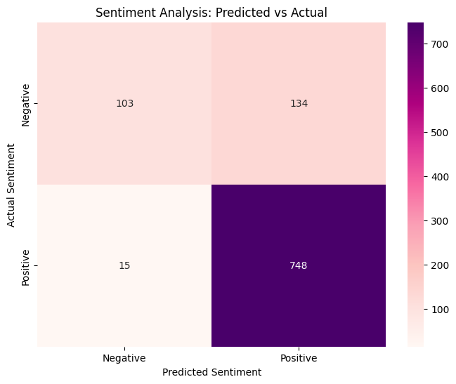

# CODTECH IT SOLUTIONS MACHINE LEARNING INTERNSHIP

## TASK 2: SENTIMENT ANALYSIS WITH NLP

### Project Overview
This project focuses on performing **Sentiment Analysis** on customer reviews. Using Natural Language Processing (NLP) techniques, we classify reviews as either positive or negative.

### Task Details
* **Organization**: CODTECH IT SOLUTIONS
* **Intern Name**: Purvi Ganvir
* **Intern ID**: CTIS6235
* **Domain**: Machine Learning
* **Duration**: 17th Feb to 17th March
* **Mentor**: Muzzamail

### Technical Roadmap
1.  **Data Preprocessing**: Cleaned raw text by removing HTML tags, punctuation, and stop words using `NLTK`.
2.  **Feature Extraction**: Implemented **TF-IDF Vectorization** to convert text data into a numerical format suitable for machine learning.
3.  **Model Selection**: Built a **Logistic Regression** model for binary classification of sentiment.
4.  **Performance Metrics**: Evaluated the model using accuracy scores and a confusion matrix to visualize correct vs. incorrect predictions.

### Key Features
* **Text Normalization**: Efficiently handles noisy text data.
* **Vectorization**: Uses Term Frequency-Inverse Document Frequency (TF-IDF) for better context understanding.
* **Analysis**: Detailed classification report showing precision, recall, and F1-score.

---

### Analysis Visualization
Below is the Confusion Matrix showing the model's performance on the test dataset:

---

### Tools & Technologies Used
* **Python**: Core programming language.
* **NLTK**: For text cleaning and stop-word removal.
* **Scikit-Learn**: For TF-IDF vectorization and Logistic Regression.
* **Seaborn/Matplotlib**: For performance visualization.
